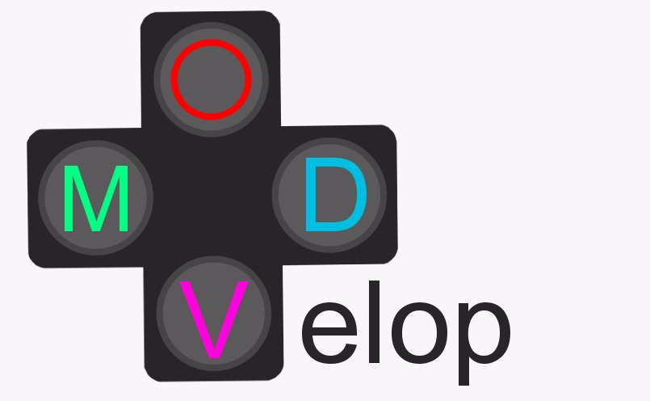
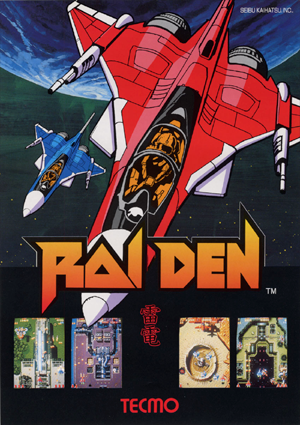
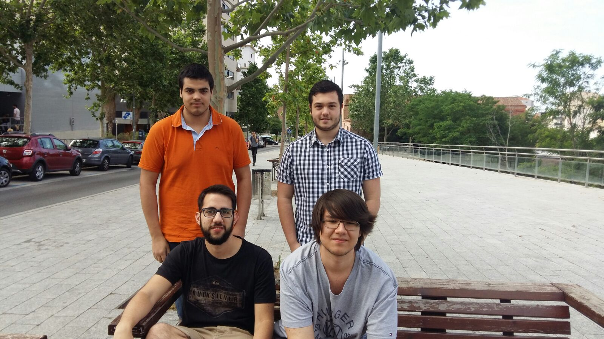

# Raiden
## by MODVelop
 

Raiden, that was developed by Seibu Kaihatsu in 1990, consist of eight vertical scrolling missions where the player controls the Raiden craft destroying the enemies. There are powerups like bombs and missiles as well as medals. When the user defeat the 8th boss of the game, the user recieve a milion points every time that completes a loop.

 

We created a version of the original arcade game. Please, try it!
 
### Raiden Tribute
<iframe width="854" height="480" src="https://www.youtube.com/embed/E6Mnbx6I5w0" frameborder="0" allowfullscreen></iframe>
 
## MODVelop staff
 

 
- Víctor Agrisuelas: Art.
 
- Óscar Hernandez: Code.
 
- Daniel Jiménez: Management.
 
- Manel Mourelo: Q/A.

# Links:
 
 
 ## [Click here to download our latest version of the game]()
 
 ## [Visit our wiki](https://github.com/Danijimenez/Projecte-I/wiki)
 
 ## [View the code of the game in our repository](https://github.com/Danijimenez/Projecte-I)
